# Hi, I'm Lyon

  

  Computer Science undergraduate at Sun Yat-Sen University.

  I build agent tooling, memory-first workflows, and practical product prototypes from real problems.

  

  generated with <a href="https://github.com/Platane/snk">Platane/snk</a>

## About Me

- 🏫 学校/方向：中山大学，Computer Science
- 🔭 当前重心：AI agents、本地工具链、长期记忆工作流、数据驱动 Web 产品
- 🧠 做事方式：先把模糊问题压成可运行的 skill、工具或原型，再继续打磨判断、交互和工程实现
- ⚙️ 技术背景：公开仓库以 Python 为主，近期持续在 TypeScript / React、agent runtime、自动化工作流方向投入
- 🌏 关注主题：agent engineering、file-first memory、实用产品原型、研究复现

  
  

## Recent Focus

- 搭建了一套本地 agent 开发环境，把 Codex、Claude 类入口、Hermes、ReMe 和记忆写回、本地 CLIProxyAPI / QClaw 模型链路接在一起，用来减少跨项目切换时的上下文丢失和重复排障。
- 在持续推进 [Image Prompt Optimizer](https://github.com/August1314/image-prompt-optimizer)：先做免费开源的 Web MVP，再保留桌面版分支作为运行时实验，用真实产品约束验证 prompt 优化器是否有价值。
- 在维护 [kaoyan-reality-radar-web](https://github.com/August1314/kaoyan-reality-radar-web)：围绕真实数据、信息结构、镜像访问和受控解锁链路，探索一个面向中国考研用户的数据产品原型。
- 也在做一些研究型和工程型交叉实验，比如 file-first personal memory、agent skills、以及数学/机器学习方向的小型复现项目。

## Selected Projects

### [Image Prompt Optimizer](https://github.com/August1314/image-prompt-optimizer)

一个围绕“把模糊图像想法变成更可控提示词”的开源产品原型。当前主线是 Web MVP，技术基线为 Vite + React + TypeScript + Vercel Functions，同时保留桌面运行时实验分支。

### [reme-personal-memory](https://github.com/August1314/reme-personal-memory)

把个人长期记忆做成 portable、file-first 的 skill，强调 markdown 工作流、跨 agent 复用，以及长期上下文的稳定维护。

### [Michael-Polanyi](https://github.com/August1314/Michael-Polanyi)

把“经验判断”收缩成可安装 skill，面向 Claude Code、Codex 和其他 AI agents，重点处理 ambiguity、trade-offs 和 incomplete information 这类不适合模板回答的场景。

### [kaoyan-reality-radar-web](https://github.com/August1314/kaoyan-reality-radar-web)

一个已经上线的考研择校现实判断工具原型，用真实数据、信息结构和直接可用的前端体验帮助用户更快完成判断。  
Live: [kaoyan-reality-radar-web.vercel.app](https://kaoyan-reality-radar-web.vercel.app)

### [eml-sheffer-reproduction](https://github.com/August1314/eml-sheffer-reproduction)

围绕论文 “All elementary functions from a single operator” 做的小型复现仓库，结合符号表达、训练原型和实验脚手架，探索数学构造在现代实验环境里的可执行版本。

## Contact

- GitHub: [@August1314](https://github.com/August1314)
- Featured project: [kaoyan-reality-radar-web.vercel.app](https://kaoyan-reality-radar-web.vercel.app)
